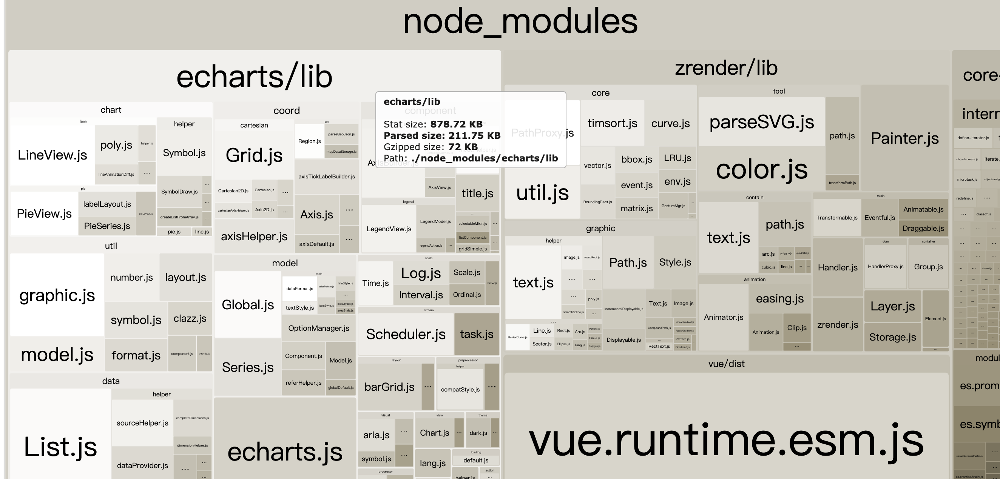
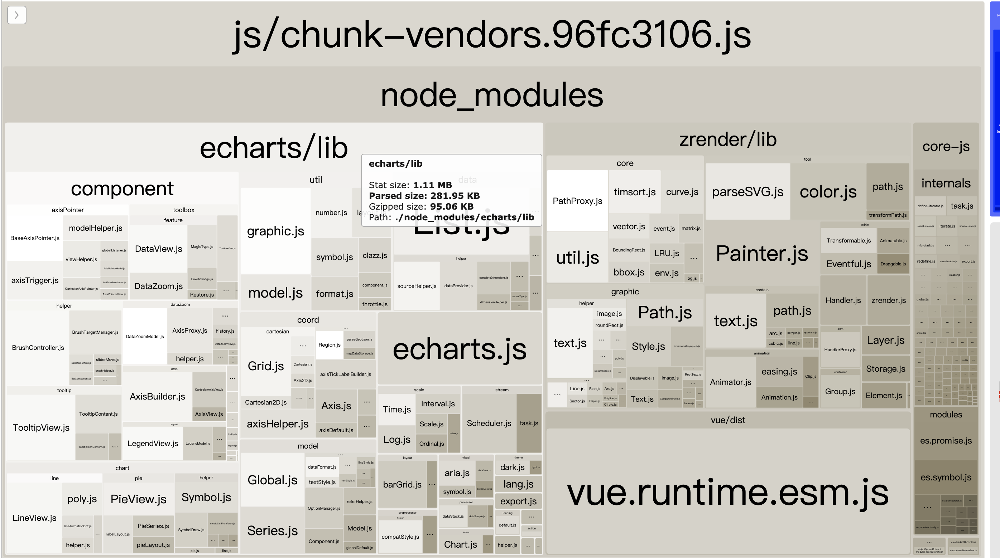
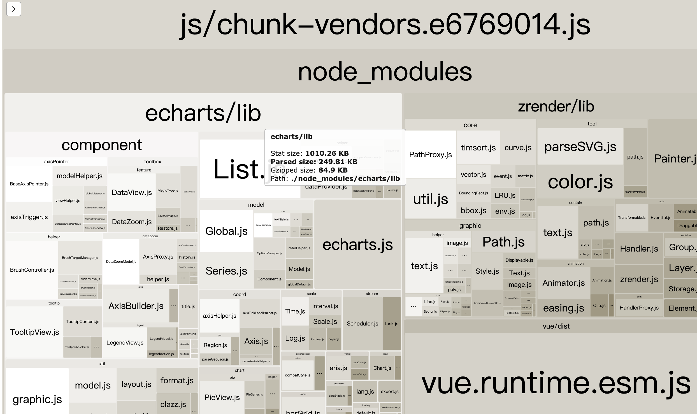
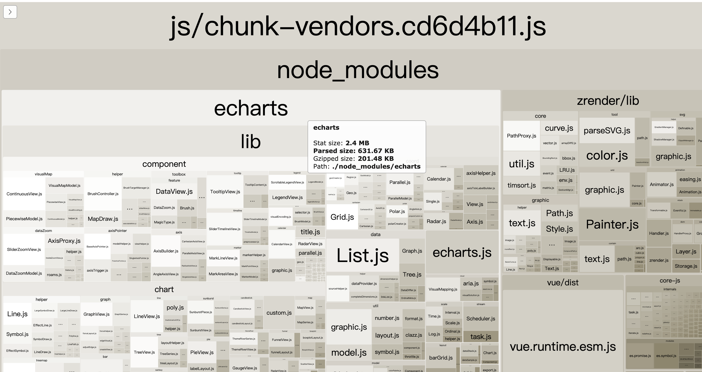

# vue-echarts-test

## Project setup
```
yarn install
```

### Compiles and hot-reloads for development
```
yarn serve
```
<hr/>

### 验证 build 之后的文件大小

```
 输入命令: yarn run build --report, 会打开一个新的html页面
```


> 自测枚举
#### 按需引入
* 1. 专门设置一个echarts配置文件,文件路径src/lib/echart.js (1.12M) (请参考下图)
```src/lib/echart.js
import echarts from 'echarts/lib/echarts'
 
// 引入你需要使用的图表类型，标题，提示信息等
import 'echarts/lib/chart/pie'
import 'echarts/lib/chart/line'
import 'echarts/lib/component/legend'
import 'echarts/lib/component/title'
 
export default echarts
 
```
使用
```
 // 直接引用
 import echarts from '@/lib/echart.js' 
```

<div align=right></div>

* 2. 利用 babel-plugin-equire 实现按需加载 (1.11M) (请参考下图)

```src/lib/echarts.js
 // eslint-disable-next-line
 const echarts = equire([
   // 写上你需要的 echarts api
   "tooltip",
   "legend",
   "toolbox",
   "pie",
   "line"
 ]);

 export default echarts;
 
```

使用
```
 // 直接引用
 import echarts from '@/lib/echarts.js' 
```

<div align=right></div>

* 3. main.js中只引入需要的模块
```
import 'echarts/lib/chart/pie'
import 'echarts/lib/component/tooltip'
import 'echarts/lib/component/title'
import 'echarts/lib/component/toolbox'
import 'echarts/lib/component/legend'
Vue.prototype.$echarts = echarts

```
<div align=right></div>

#### 全局引入

* 4. 方式1: 全局引用 （2.4M） (请参考下图)
```main.js
  import echarts from 'echarts'
  import 'echarts/lib/echarts'
  import 'echarts/lib/chart/pie'
  import 'echarts/lib/component/tooltip'
  import 'echarts/lib/component/title'
  import 'echarts/lib/component/toolbox'
  import 'echarts/lib/component/legend'

  Vue.prototype.$echarts = echarts
```

* 5. 使用vue-echarts   (请参考下图)

```main.js
  import ECharts from 'vue-echarts'
  import 'echarts/index'
  // 注册为全局组件
  Vue.component('v-chart', ECharts)
```
组件使用
```
<v-chart chartId="myChart" :options="chartOptions" width="300px" height="300px" :auto-resize="true"></v-chart>
```
<div align=right></div>
